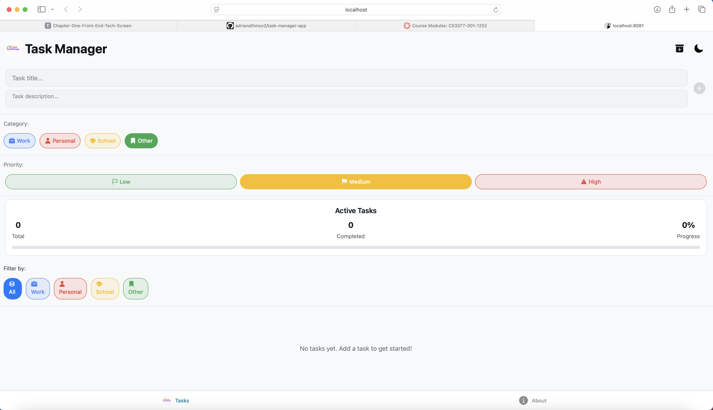

# Task Manager App

This is a feature-rich task management application built with React Native and Expo. This app allows users to add, organize, save, delete and track tasks with an intuitive interface that adapts to light and dark themes based on user preference.

## Features

- **Task Management**
  - Create new tasks with detailed descriptions
  - Mark tasks as complete with visual indicators
  - Delete unwanted tasks with trash icon or swipe gesture
  - Archive tasks to maintain a clean workspace and saved completed tasks
  - Categorize tasks by type (Personal, Work, School, Other)
  - Set priority levels for tasks (Low, Medium, High)

- **User Interface**
  - Clean, modern design with smooth animations
  - Responsive layout that works across different screen sizes
  - Progress tracking with visual completion bar
  - Task statistics dashboard showing completion metrics
  - Interactive UI elements with haptic feedback and animation
  

- **Theme System**
  - Toggle between light and dark themes with a single tap
  - Theme automatically adapts to device settings
  - Contains a consistent theme across all UI components
  - Optimized contrast for readability in both modes
  

- **Performance**
  - Fast, native-like performance
  - Efficient state management using React Context
  - Optimized rendering with memo and callback patterns
  - Smooth transitions between screens and states

## Screenshots



## Getting Started

### Prerequisites

- Node.js (v14 or later)
- npm (v6 or later) or yarn (v1.22 or later)
- Expo CLI (`npm install -g expo-cli`)
- For mobile development:
  - iOS: macOS with Xcode (13+)
  - Android: Android Studio with SDK and emulator

### Installation

1. Clone the repository
   ```bash
   git clone <repository-url>
   cd task-manager-app
   ```

2. Install dependencies
   ```bash
   npm install
   # or with yarn
   yarn install
   ```

3. Start the development server
   ```bash
   npx expo start
   ```

### Running the App

The Task Manager app can be run in several environments:

- **Web Browser**: 
  ```bash
  npx expo start --web
  ```

- **Android Emulator**: 
  ```bash
  npx expo start --android
  ```

- **iOS Simulator**: 
  ```bash
  npx expo start --ios
  ```

- **Physical Device**: 
  1. Install the Expo Go app from App Store/Google Play
  2. Run `npx expo start`
  3. Scan the QR code with your camera (iOS) or Expo Go app (Android)

## How to Use

### Managing Tasks

1. **Adding a New Task**
   - Tap the input field at the top of the screen
   - Enter a task description
   - Select a category (optional)
   - Choose a priority level (optional)
   - Tap "Add" or press Enter

2. **Completing Tasks**
   - Tap the checkbox next to any task to mark it as complete
   - Completed tasks will show a checkmark and strikethrough text

3. **Removing Tasks**
   - Swipe left on any task to reveal the delete option
   - Tap the trash icon to permanently remove the task

4. **Task Organization**
   - Use the category filters to show tasks by type
   - Toggle the archive button to hide/show completed tasks
   - Check the statistics panel to track your progress

### Theme Customization

- Tap the theme toggle icon (sun/moon) in the header
  - When in light mode, you'll see a moon icon (tap to switch to dark mode)
  - When in dark mode, you'll see a sun icon (tap to switch to light mode)

## App Architecture

### State Management

The app uses React's Context API for global state management:

- **TaskContext**: Handles all task-related operations
  - Stores the task list with completion status
  - Provides methods for adding, updating, and deleting tasks
  - Manages task filtering and sorting

- **ThemeContext**: Controls the app's visual appearance
  - Manages light/dark theme toggling
  - Provides themed styles to all components
  - Adapts to system preferences

### Component Structure

- **Core Components**:
  - `TaskInput`: For creating new tasks
  - `TaskList`: Container that renders all task items
  - `TaskItem`: Individual task with interactive controls
  - `TaskStats`: Visual representation of completion progress
  - `CategoryFilter`: Filtering mechanism for task categories
  - `PrioritySelector`: UI for selecting task priority
  - `ThemeToggle`: Switch for light/dark mode

- **UI Components**:
  - `ThemedText`: Text that adapts to current theme
  - `ThemedView`: Container that applies theme styles
  - `ArchiveButton`: Toggle for showing/hiding completed tasks
  - `ArchiveToggle`: Alternative UI for archive functionality

## Third-Party Libraries

| Library | Version | Purpose |
|---------|---------|---------|
| React Native | 0.71+ | Core framework for building native apps with React |
| Expo | ^48.0.0 | Development platform with pre-built components and services |
| Expo Router | ^1.0.0 | File-based routing system for navigation |
| Expo Haptics | ^12.0.0 | Provides haptic feedback for user interactions |
| Expo Status Bar | ^1.4.0 | Manages the status bar appearance |
| React Native Reanimated | ^2.14.0 | Library for creating fluid animations |
| React Native Gesture Handler | ^2.9.0 | Handles touch and gesture interactions |
| Ionicons | via Expo | Icon set used throughout the UI |

## Troubleshooting

### Common Issues

- **Metro bundler not starting**:
  ```bash
  # Kill any running instances and clear cache
  pkill -f "npx expo" && npx expo start --clear
  ```

- **Dependencies errors**:
  ```bash
  # Reset node modules and reinstall
  rm -rf node_modules && npm install
  ```

- **Expo Go connection issues**:
  1. Ensure your mobile device is on the same network as your computer
  2. Try using the "tunnel" connection option: `npx expo start --tunnel`

- **Rendering issues**:
  - Toggle between development and production mode
  - Use a physical device for accurate rendering

## Code Documentation

The codebase includes comprehensive comments for all components and functions:

- **Component files**: Include purpose, props documentation, and usage notes
- **Hooks**: Detailed parameter and return value documentation
- **Context providers**: Clear explanation of state management approach
- **Style objects**: Notes about theming implementation

## Future Enhancements

- Cloud synchronization for tasks across devices
- Recurring task scheduling
- Due date reminders with notifications
- Data analytics and productivity insights
- Collaborative task sharing
- Rich text formatting for task descriptions
- Customizable themes beyond light/dark
